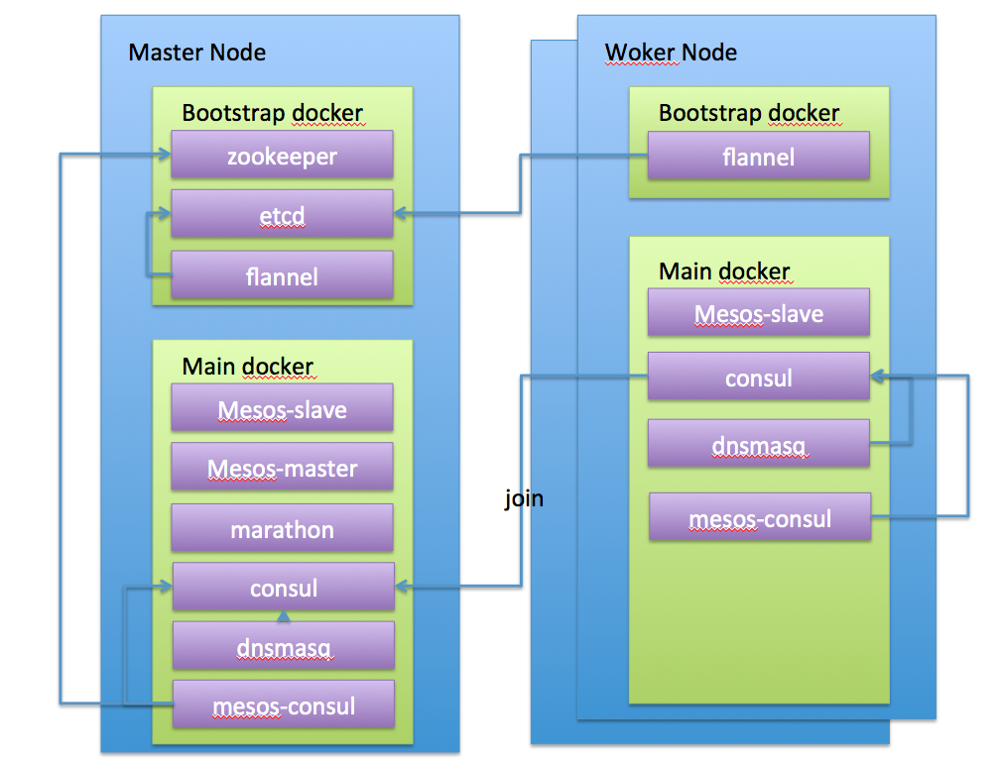

# mesos-deploy

This is a repository of community maintained Mesos cluster deployment
automations.


## 架构

Here's a diagram of what the final result will look like:


## 创建一个mesos集群


### 在阿里云上创建一台centos7u2/7u3虚拟机，作为master兼作worker,建议2c4g

在机器上执行如下命令 ，安装git和mesos-deploy

```
yum install -y git glances && cd /opt && git clone https://github.com/uniseraph/mesos-deploy.git  && cd mesos-deploy && git checkout singlemaster


```

#### 初始化flannel网络端
如果是阿里云vpc网络，vm的ip端在192.168.0.0/16，则设置FLANNEL_NETWORK=172.16.0.0/12,否则可以忽略。

```
export FLANNEL_NETWORK=172.16.0.0/12
```

注意FLANNEL_NETWORK不能和虚拟机的网段冲突。

#### 初始化 master 相关服务
```

cd /opt/mesos-deploy && MASTER_IP=xxxx PROVIDER=aliyun API_SERVER=tcp://xxxx:8080 bash -x setup-master.sh   --type=swarm

```


### 创建一个1c1g的虚拟机，加入到集群中

建议centos7u2


#### 初始化worker机器

```
yum install -y git glances && cd /opt && git clone https://github.com/uniseraph/mesos-deploy.git  && cd mesos-deploy && git checkout singlemaster

```

#### 安装并加入集群

```
cd /opt/mesos-deploy && MASTER_IP=xxxx PROVIDER=aliyun API_SERVER=tcp://xxxx:8080 bash -x setup-worker.sh   --type=swarm


```


##  验证
 gi
### 创建一个nginx app(swarm)


### 容器集群管理


访问master集群的公网ip ， http://y.y.y.y:9000

### 日志和性能监控 , http://y.y.y.y:5601


### 创建一个nginx app

```
curl  -H 'Content-Type: application/json' -d @nginx.json  kvm1:8080/v2/apps

```
nginx.json内容为
```
{
  "id": "/nginx1",
  "cmd": null,
  "cpus": 0.1,
  "mem": 128,
  "disk": 0,
  "instances": 1,
  "acceptedResourceRoles": [],
  "container": {
    "type": "DOCKER",
    "volumes": [],
    "docker": {
      "image": "nginx",
      "network": "BRIDGE",
      "portMappings": [
        {
          "containerPort": 80,
          "hostPort": 0,
          "servicePort": 10000,
          "protocol": "tcp",
          "labels": {}
        }
      ],
      "privileged": false,
      "parameters": [],
      "forcePullImage": true
    }
  },
  "healthChecks": [
    {
      "gracePeriodSeconds": 300,
      "intervalSeconds": 60,
      "timeoutSeconds": 20,
      "maxConsecutiveFailures": 3,
      "portIndex": 0,
      "path": "/",
      "protocol": "HTTP",
      "ignoreHttp1xx": false
    }
  ],
  "portDefinitions": [
    {
      "port": 10000,
      "protocol": "tcp",
      "name": "default",
      "labels": {}
    }
  ]
}
```


## 其他

### bridge container ping host
在阿里云经典网络场景中，阿里云会对vm发出的icmp包进行源mac/源ip校验，所以如果是bridge container ping 宿主机，会通不过校验，导致icmp request被丢弃，所以ping不通。vpc不存在类似问题

在经典网络中，marathon只能以host模式启动。
      
